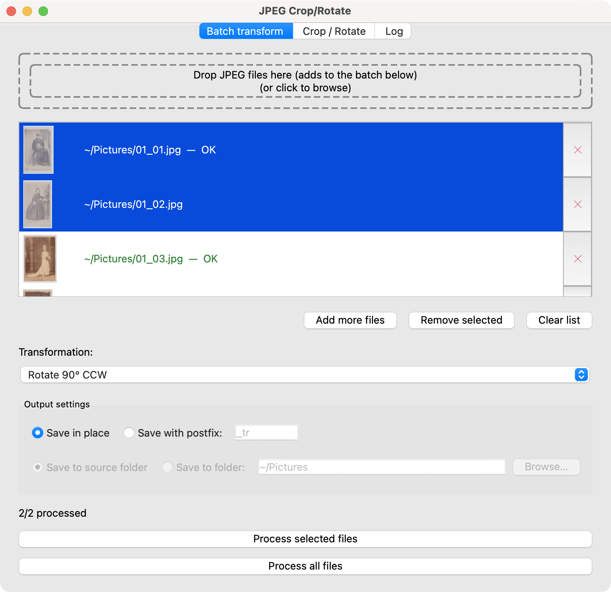
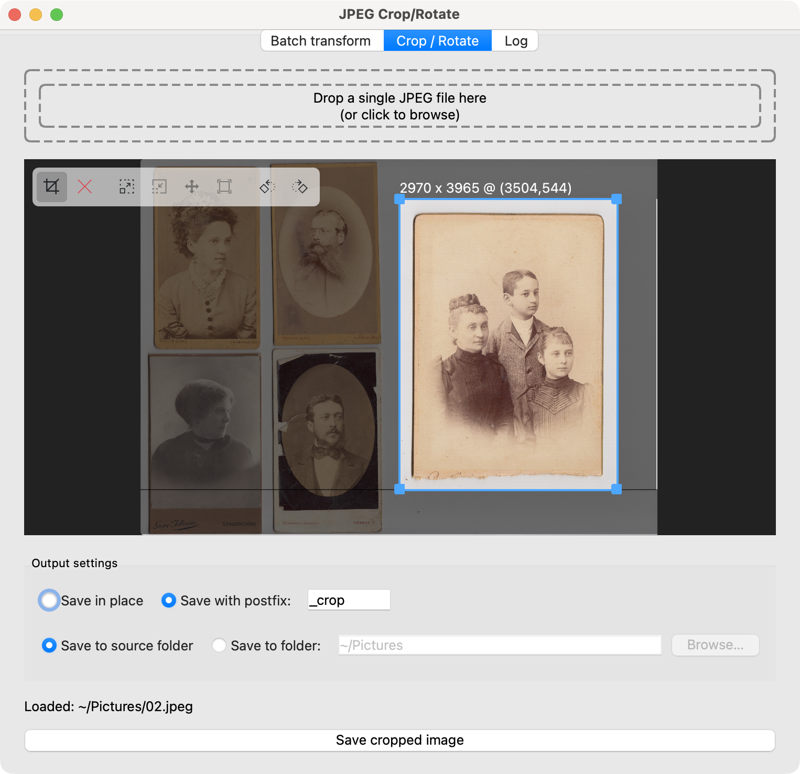
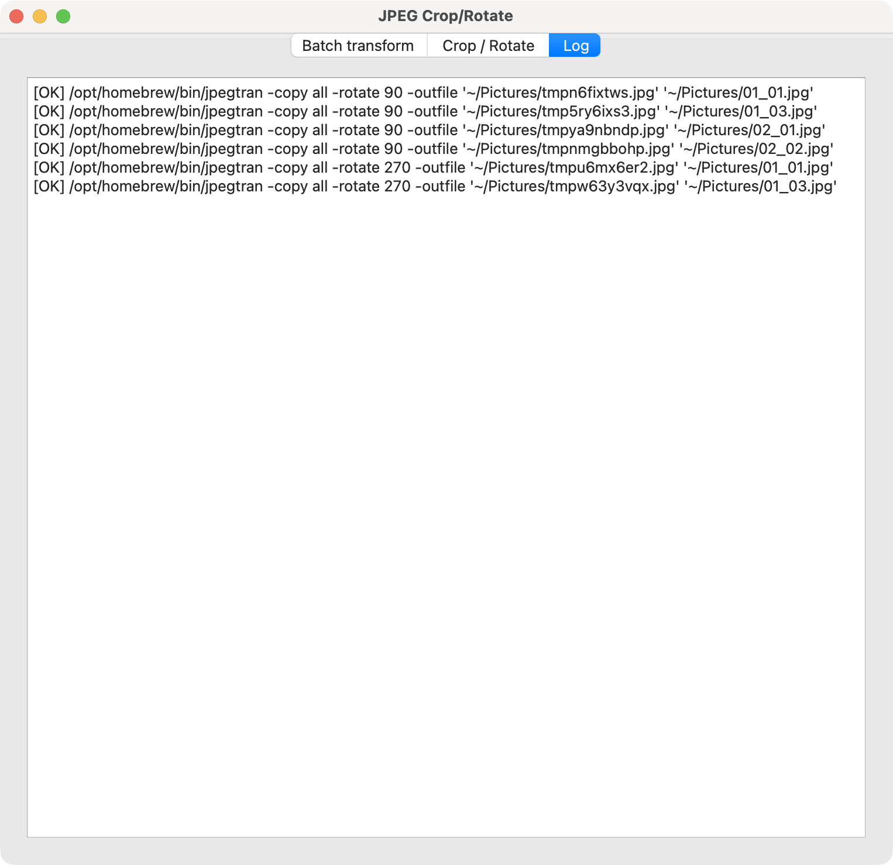

# jpeg-crop-rotate

A tiny PyQt6 desktop app for losslessly rotating/flipping and cropping JPEG
files, using [`jpegtran`](https://jpegclub.org/jpegtran/) so that the image data is
not re-encoded.

## Requirements

- **[uv](https://docs.astral.sh/uv/)** — used to run the app; it fetches the
  Python dependencies automatically, no separate install step.
- **`jpegtran`** on your `PATH`. On macOS:

  ```
  brew install jpeg-turbo
  ```

- **The `icons/` folder** must stay alongside `app.py` — it supplies the
  toolbar icons (from the [Breeze icon theme](https://invent.kde.org/frameworks/breeze-icons),
  GPL-licensed — see `icons/COPYING`) and is read directly from disk at
  startup. If it's missing, the app still runs, just with blank (icon-less)
  toolbar buttons — tooltips still work.

## Running it

```
uv run app.py
```

This opens the app window directly — `uv` resolves and caches the Python
dependencies (`PyQt6`, `piexif`) declared inline in `app.py` on first run.

## Usage

The app has three tabs.

### Batch transform



- Drag JPEG files onto the drop zone (or click it to browse) to build up a
  batch. The list shows a thumbnail, the file's path, and a per-row delete
  (✕) button; click/shift/cmd-click rows to multi-select. Below the list:
  **Add more files**, **Remove selected**, and **Clear list**.
- Pick a transform from the dropdown (90° CW/CCW, 180°, flip
  horizontal/vertical, transpose, transverse — the full set of lossless
  `jpegtran` transforms).
- Under **Output settings**: choose to overwrite files in place (with a
  confirmation prompt) or save alongside the originals with a postfix
  (default `_tr`); and choose whether each file saves back into its own
  source folder (the default — useful when the batch mixes files from
  different folders) or into one folder you pick.
- Click **Process all files**, or select specific rows first and click
  **Process selected files**. After each row finishes, its path text turns
  green with "OK" or red with "FAILED: ..."; if a file was edited in place,
  its thumbnail refreshes to match the new file content. The app also
  resets the output's EXIF `Orientation` tag to normal, so viewers that
  honor that tag don't double-rotate the image.

### Crop / Rotate



- Drag a single JPEG file onto the drop zone (or click it to browse). The
  app keeps its own private copy of what you loaded, so later crops stay
  correct even if you overwrite the original in place along the way; the
  loaded image stays put across saves — drop a different file, or click the
  drop zone again, to load something else.
- A floating toolbar sits over the top-left of the preview:
  - **Crop** — the default tool: drag out a selection, drag its body to
    move it, or a corner handle to resize it.
  - **Clear** — drops the current selection.
  - **Zoom in / Zoom out** — doubles/halves the zoom, from 1x up to 32x, for
    precise placement of a crop corner. Zooming keeps the current view
    centered. 
  - **Move** — pans the view once you're zoomed in (only enabled above 1x);
    mutually exclusive with Crop.
  - **1:1** — resets back to the normal fit-to-window view.
  - **Rotate CCW / Rotate CW** — rotates the preview (and any active
    selection) 90° at a time
- The selection's origin snaps to a 16px grid — this matches how `jpegtran`
  aligns crops internally, so the on-screen selection always matches the
  saved output exactly (no silent expansion).
- **Output settings** work the same as the Batch transform tab (in-place vs.
  postfix, default `_crop`; source folder vs. a chosen folder).
- Click **Save image**. If the image was rotated but nothing is
  selected, Save still works — it just applies the rotation to the whole
  image, so this tab doubles as a single-image lossless rotator.

### Log



- A running, read-only list of every `jpegtran` command the app has
  executed this session, with success/failure status — useful for
  debugging or just seeing exactly what happened.

## How it works

All transforms shell out to `jpegtran -copy all ...`, which rewrites the
JPEG's DCT-coefficient data directly (rotate/flip/crop) without decoding
and re-encoding, so there's no generation loss. `-copy all` preserves
existing metadata (EXIF, ICC profiles, etc.).

## Development

`app.py` is the whole app: a standalone script with its dependencies
declared inline (PEP 723), meant to be run as `uv run app.py` with no
install step. `pyproject.toml` exists only for the test suite below — it
has no effect on that inline-metadata script mode.

### Running the tests

```
uv run pytest
```

This is fully offline and self-contained — `uv` creates a `.venv` (from
`pyproject.toml`'s `dev` dependency group: pytest, Pillow, PyQt6, piexif) on
first run and reuses it after that. No network access is needed beyond that
first package fetch, and no fixture images are checked into the repo — the
suite generates its own throwaway JPEGs per test via a `tmp_path`-based
fixture. Tests that need `jpegtran` are skipped automatically (with a clear
reason) if it isn't on `PATH`.

Tests live in `tests/`, organized by component:

- `test_utils.py` — pure helpers (`display_path`, `build_postfix_path`, `CommandLog`).
- `test_save_mode.py` — the shared "Output settings" widget (in-place vs.
  postfix, source folder vs. a chosen target folder).
- `test_drop_zone.py` — click-to-browse and JPEG-only filtering.
- `test_rotate_tab.py` — the batch file list, processing all vs. selected
  files, in-place thumbnail refresh, and the existing-target
  skip/overwrite/apply-to-all flow.
- `test_crop_view.py` — the crop rectangle, the zoom/pan "virtual camera",
  and crop/move tool switching.
- `test_crop_tab.py` — the snapshot mechanism, save pipeline, and
  rotate-only saves.
- `test_jpegtran.py` — the `jpegtran` subprocess wrapper, including the
  empirically-verified crop-offset rounding behavior the 16px snap grid
  depends on.
